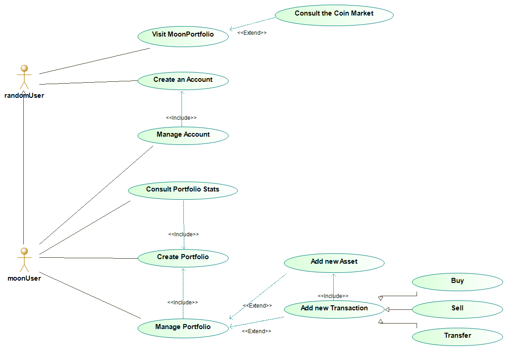

# :new_moon: MoonPortfolio :new_moon: ---> 🚧 WORK IN PROGRESS 🚧

__Init Date :__ 14/04/2021
__Subject :__ Asset Manager Web App
__Tech used :__ Django, Bootstrap, Python, HTML, CSS, JS

__Goal :__ 

User-Friendly Asset Manager which allows users to easily manage their assets whatever the broker is.

A MoonUser can :
* Create a portfolio
* Add new Assets
* Add transactions (Buy, Sell, Convert, Transfer)
* Follow his portfolio's activity
* Manage his expenses

## Functional Analysis :
MoonPortfolio
### Synopsis :
 
Monke has 3 assets on Binance and 2 others on Coinbase. However, Monke would like to manage all of his assets and have a global view on their evolution overtime.

Monke creates a portfolio on MoonPortfolio and inputs all the data about his assets's transactions.
A transaction is defined by the its type (Buy, Sell, Convert, Transfer) and the concerned asset. Then, informations such as buy/sell date, amount will be asked to input the exact transaction.

Now, Monke can check all of his assets activity in one place and consult the Coin Market to make Godlike decisions.

### Use Case Diagram :

# Technical Analysis

# Must/Should/Could/Would

| Functionalities                                                  | MoSCoW | Done ? |
| :--------------------                                            | ------ | -----: |
| Project initialization                                           | M |:white_check_mark:|
| Monke Registering/Signing In                                     | M |:white_check_mark:|
| Consulting the Coin Market                                       | M |:white_check_mark:|
| Consulting Coin Details                                          | M |:white_check_mark:|
| Creating a portfolio/add assets                                  | M |:x:|
| Adding Transactions (Buy, Sell, Convert, Transfer)               | M |:x:|
| Overviewing transactions and dashboard                           | M |:x:|
| Interacting with in the blog (Create, Modify, Delete, Comment)   | S |:x:|
| Modifying and Customize Profile                                  | S |:x:|
